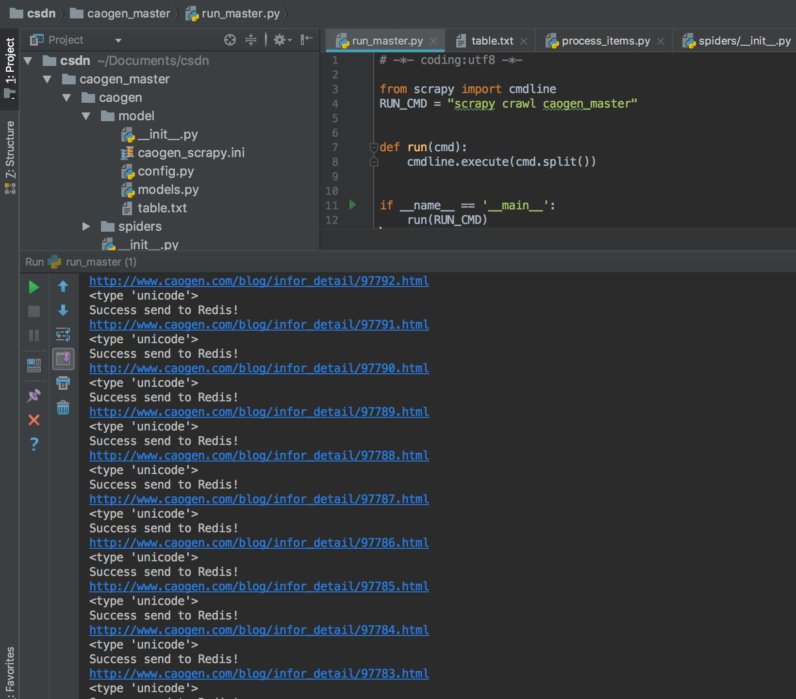
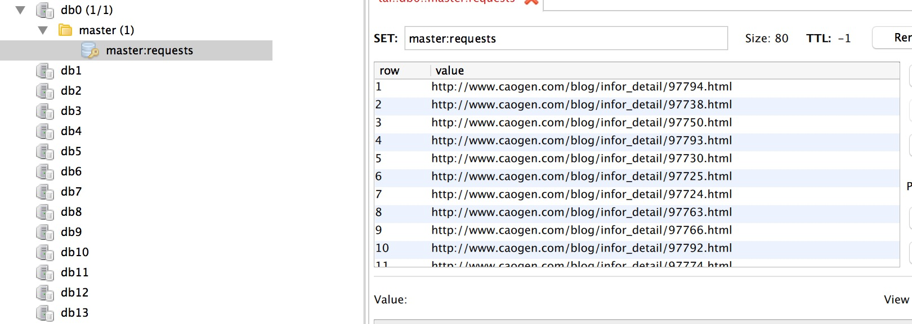
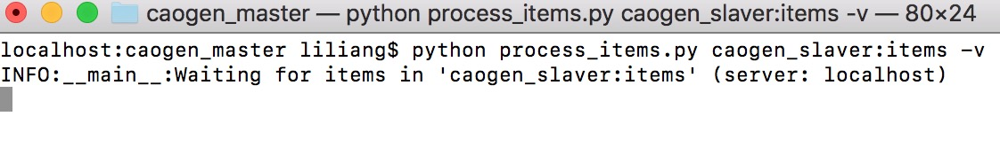
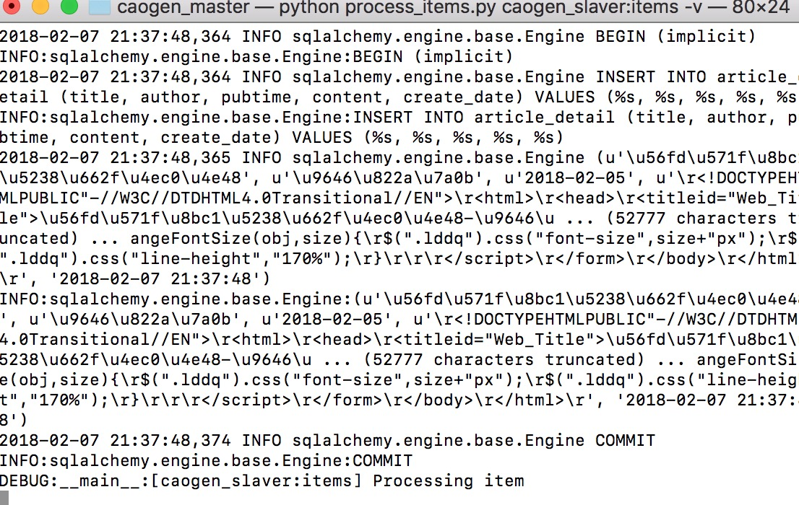
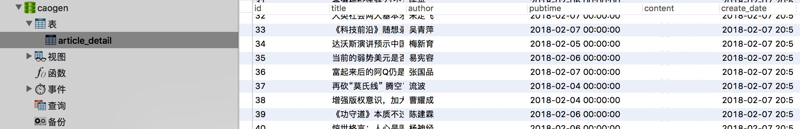

# 草根网分布式爬虫之Master端
**简介:**

这一模块主要负责将草根网的文章url传输进入redis，然后从redis中取出爬虫服务器(slaver)返回的item存入数据库

安装
----
**1** scrapy

```
$ sudo pip install scrapy

```
**ps.```scrapy```安装对于不同的环境配置都会有不同，这里我很难给出一个详细的教程，大家根据自己的情况Google一下或者我这里推荐一些我认为不错的:**

* [scrapy安装教程-win](http://blog.csdn.net/bemorequiet/article/details/62885881)
* [scrapy安装教程-mac](https://www.jianshu.com/p/a03aab073a35)
* [scrapy安装教程-ubuntu](http://blog.csdn.net/qq_30242609/article/details/52810765)

安装好之后打开```python```界面输入

```python
import scrapy 
scrapy.__version__
```
,如果安装成功应该会出现如下界面:


**2** redis安装:
```
$ sudo apt-get install redis-server
```
**ps.redis安装可以参考[这里](http://www.runoob.com/redis/redis-install.html)**

**3** scrapy-redis安装:

```
$ sudo pip install scrapy-reids
```

**4** mysql安装:
请参考[这里](https://dev.mysql.com/downloads/mysql/5.6.html#downloads)，本例中使用的是```MySQL5.6.38```版本

**5** sqlalchemy安装:

```
$ sudo pip install sqlalchemy

```
**6** 其他:

* 可能还有一些软件的安装，每个人使用情况不同，我的IDE是[PyCharm](https://www.jetbrains.com/pycharm/),Mysql可视化工具使用的是[Navicat](http://www.navicat.com.cn/products/),Redis可视化工具使用的是[Redis-Desktop-Manager](https://redisdesktop.com/)


配置
----
* 在model/caogen_scrapy.ini文件中修改数据库配置

```
[default]
host=127.0.0.1
port=3306
user=root
password=
db=caogen
echo=True
```

* 在model/caogen_scrapy.ini文件中修改redis的配置

```
[default]
host = 127.0.0.1
port = 6379
```

* 建表,具体的可以参照model模块中的models.py文件,所有的建表语句都在model/table.txt文件中

**Ps. 请根据自己的情况修改**

运行说明
-------

**1** 找到根目录下的```run_master.py```文件,运行命令文件即可:

```
$ python run_master.py
```

* 运行成功可以看到```redis```数据库中已经存入了文章url,如图:



>我们查看redis数据库也能看到结果:



**2** 开启process_item,等待爬虫[slaver](https://github.com/MrPaoBrother/caogen_slaver)端传来的item

```
$ python process_items.py caogen_slaver:items -v
```

* 若开启成功，则**如下图:**


**Ps.如果[slaver](https://github.com/MrPaoBrother/caogen_slaver)端没有传item过来，master端会一直忙等下去**

**3** 开启子爬虫服务器: **详情见草根网分布式爬虫之```Slaver```端文档**

**4** 开启[slaver](https://github.com/MrPaoBrother/caogen_slaver)之后，可以看到第二步开启的process_item监测到了数据，并且传入了数据库,**如下图**:



* 再查看Navicat,**如下图:**



**运行完成...**


注意事项
-------
**1** 如果项目运行中缺少什么模块，请自行根据报错信息安装，这里不可能给出全部的可能

**2** 项目中没有设置一些中间件，只是单纯的展示一遍分布式爬虫的基本概念，有兴趣的朋友可以贡献一些改进代码。

**3** 如果项目中在运行时有什么```bug```,请留言。

**4** 该项目要配合[slaver](https://github.com/MrPaoBrother/caogen_slaver)端一起运行才能展示效果，请注意。

相关资料
-------
* [scrapy中文文档](http://scrapy-chs.readthedocs.io/zh_CN/0.24/)
* [scrapy-redis相关文档](https://scrapy-redis.readthedocs.io/en/stable/)